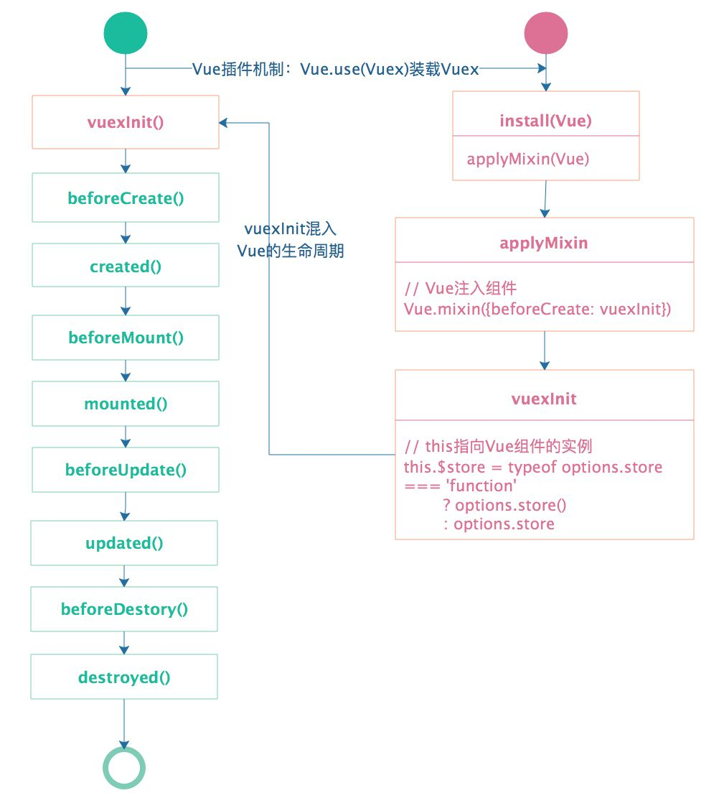

##### 问题1：Vuex如何挂在到组件中的
1. 利用Vue.use机制，将会调用vuex的install方法，装载vuex，代码如下
```javascript
export function install (_Vue) {
  if (Vue && _Vue === Vue) {
    if (process.env.NODE_ENV !== 'production') {
      console.error(
        '[vuex] already installed. Vue.use(Vuex) should be called only once.'
      )
    }
    return
  }
  Vue = _Vue
  applyMixin(Vue)
}
```
2. **applyMixin**方法采用混入的方式，在每个组件的生命周期**beforeCreate**中混入**vuexInit**方法。分析源码最终将**this.$store**混入组件当中
```javascript
Vue.mixin({ beforeCreate: vuexInit });

function vuexInit () {
    const options = this.$options
    // store injection
    if (options.store) {
      this.$store = typeof options.store === 'function'
        ? options.store()
        : options.store
    } else if (options.parent && options.parent.$store) {
      this.$store = options.parent.$store
    }
}
```
**混入步骤**


##### 问题2：vuex的state和getters是如何映射到各个组件实例中响应式更新状态呢？
vuex通过利用Vue实例的**data**和**computed**数据绑定，通过创建一个Vue实例来将state和getter进行响应更新状态
```javascript
function resetStoreVM (store, state, hot) {
  const oldVm = store._vm

  // 设置 getters 属性
  store.getters = {}
  const wrappedGetters = store._wrappedGetters
  const computed = {}
  // 遍历 wrappedGetters 属性
  forEachValue(wrappedGetters, (fn, key) => {
    // 给 computed 对象添加属性
    computed[key] = partial(fn, store)
    // 重写 get 方法
    // store.getters.xx 其实是访问了store._vm[xx]，其中添加 computed 属性
    Object.defineProperty(store.getters, key, {
      get: () => store._vm[key],
      enumerable: true // for local getters
    })
  })

  const silent = Vue.config.silent
  Vue.config.silent = true
  // 创建Vue实例来保存state，同时让state变成响应式
  // store._vm._data.$$state = store.state
  store._vm = new Vue({
    data: {
      $$state: state
    },
    computed
  })
  Vue.config.silent = silent

  // 只能通过commit方式更改状态
  if (store.strict) {
    enableStrictMode(store)
  }
}
```
[参考链接](https://zhuanlan.zhihu.com/p/78981485)

