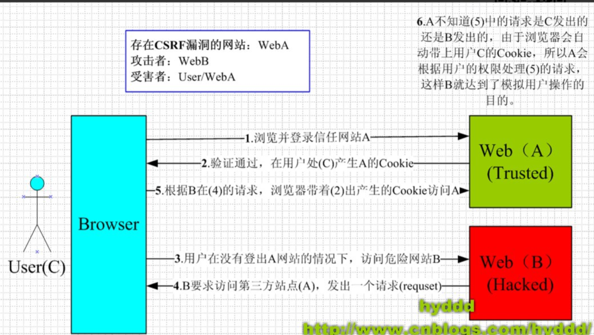

##### csrf攻击原理


##### 攻击手段
1. 客户端使用get请求进行敏感操作
  - 银行网站A，它以GET请求来完成银行转账的操作，如：http://www.mybank.com/Transfer.php?toBankId=11&money=1000
　危险网站B，它里面有一段HTML的代码如下：
　```  ```
银行网站A违反了HTTP规范，使用GET请求更新资源。在访问危险网站B的之前，你已经登录了银行网站A，而B中的img以GET的方式请求第三方资源（这里的第三方就是指银行网站了，原本这是一个合法的请求，但这里被不法分子利用了），所以你的浏览器会带上你的银行网站A的Cookie发出Get请求，去获取资源“http://www.mybank.com/Transfer.php?toBankId=11&money=1000”，
结果银行网站服务器收到请求后，认为这是一个更新资源操作（转账操作），所以就立刻进行转账操作......
2. 参考链接
3. 参考链接

##### 防御手段
1. 利用csrf不能获取cookie，每次请求带上cookie的一个随机数
2. 使用验证码。每次的用户提交都需要用户在表单中填写一个图片上的随机字符串
3. one-time token


[浅谈CSRF攻击方式](https://www.cnblogs.com/hyddd/archive/2009/04/09/1432744.html)