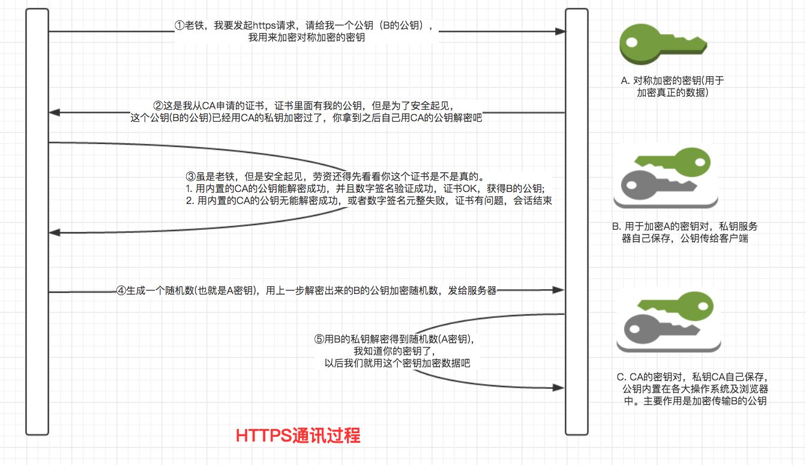

##### HTTPS加密过程
1、服务器将携带的公钥向数字证书机构申请证书。
2、数字证书机构用自己的私钥对服务器发过来的公钥签名颁发证书，并返回给服务器。
3、服务器将申请携带公钥的证书分发给客服端。
4、客户端验证证书，证书机构通过验证，或者用户接受不受信任的证书(非权威机构颁发的证书)。获取到公钥。到这一步，在证书保证下服务器拥有私钥，客户端拥有公钥，可进行非对称性加密。
5、使用公钥加密报文发送给服务器，其中携带随机串。其中的随机串用户传输数据时进行对称加密
6、服务器使用私钥解密。获取报文信息及随机串。
7、解密后服务器发送握手消息给客户端。
8、客户端接受握手消息，握手结束，双方确定加密算法(使用随机串确定的对称性加密)，开始传输。

##### 最后仍然使用密钥通信的原因
- 对称加密速度快，缺点，需要让密钥在网络中传输
- 非对称加密，数据越大，加密和解密所需要的时间越长，不需要发送私钥，只需要发送公钥就可以对数据进行加密

##### 数字证书如何防止被劫持篡改
- 篡改。数字证书的公钥是通过CA机构的私钥进行加密的，如果中途被恶意篡改，由于中间人无法获取CA的私钥，无法重新进行加密，如果强行进行加密，客户端将无法进行解密。
- 证书被替换。中间机构劫持服务器发送过来的证书，然后替换为自己申请的证书，当客户端接收到中间机构的证书时，客户端会对可以对证书进行解密，但同时浏览器会将请求的域名和证书中的域名进行对比，如果不匹配则会发出警告。

