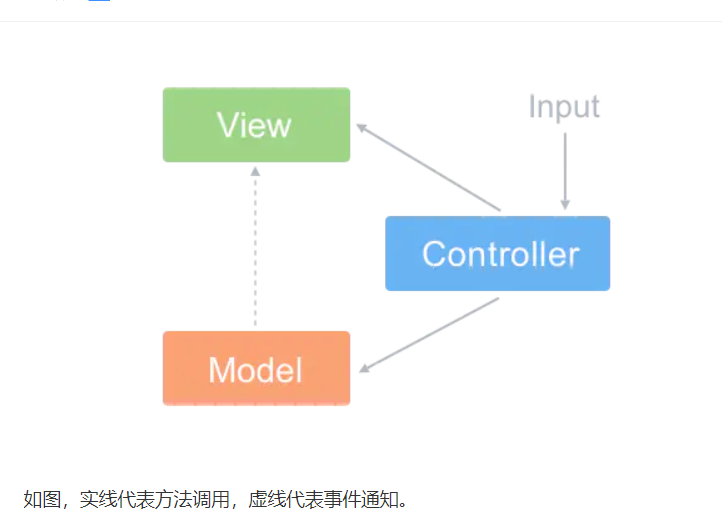

##### MVC各字母的意义
- **Model**
Model层用于封装和应用程序的业务逻辑相关的数据以及对数据的处理方法
- **View**
View作为视图层，主要负责数据的展示。

- **Controller**
它主要负责用户与应用的响应操作，当用户与页面产生交互的时候，Co
ntroller 中的事件触发器就开始工作了，通过调用 Model 层，来完成对 Model 的修改，然后 Model 层再去通知 View 层更新。

##### MVC构架图

MVC允许在不改变视图的情况下改变视图对用户输入的响应方式，用户对View的操作交给了Controller处理，在Controller中响应View的事件调用Model的接口对数据进行操作，一旦Model发生变化便通知相关视图进行更新

##### 模块的联系
- Controller负责初始化
- View和Model之间采用观察者模式进行消息的通知
- Controller主要负责用户的交互,采用策略模式与View绑定进行方法调用
- 完整过程
> 调用Controller进行初始化调用,调用Model方法注册与View的关系 -> 
用户操作按钮进行交互 ->
 Controller调用Model方法 -> 
 Model通过观察者模式通知View进行更新视图 ->
  View调用Model的方法获取值更新视图

  ##### MVC的局限性
  MVC模式的业务逻辑主要集中在Controller，而前端的View其实已经具备了独立处理用户事件的能力，当每个事件都流经Controller时，这层会变得十分臃肿。而且MVC中View和Controller一般是一一对应的，捆绑起来表示一个组件，视图与控制器间的过于紧密的连接让Controller的复用性成了问题。
