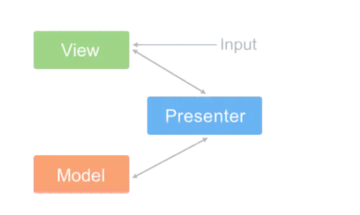

##### MVP介绍
MVP（Model-View-Presenter）是MVC模式的改良，由IBM的子公司Taligent提出。和MVC的相同之处在于：Controller/Presenter负责业务逻辑，Model管理数据，View负责显示。

- View 
对比MVC，将Model与View进行解耦，View相对更加独立，可以抽离出来做成组件，只需要暴露接口给上层就可以

- Model
仍然为数据层，对业务数据进行管理

- Presenter
联系View与Model，用户将View的操作转移给Presenter，待Presenter通知Model更新后，Presenter通知更新View视图

##### MVP结构图

##### 存在问题
Presenter作为View和Model之间的“中间人”，除了基本的业务逻辑外，还有大量代码需要对从View到Model和从Model到View的数据进行“手动同步”，这样Presenter显得很重，维护起来会比较困难。而且由于没有数据绑定，如果Presenter对视图渲染的需求增多，它不得不过多关注特定的视图，一旦视图需求发生改变，Presenter也需要改动。
